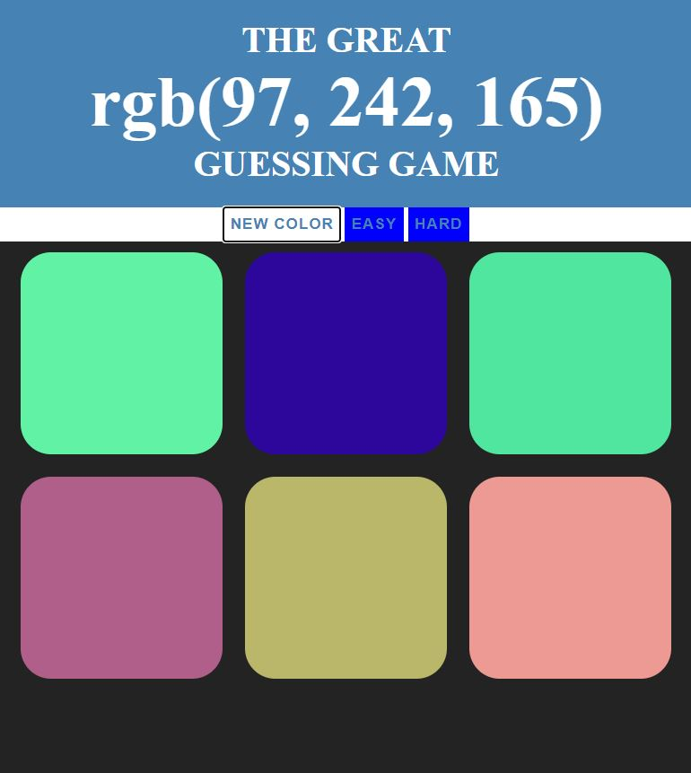

 
 
 This is a browser based game that will help you improve your knowledge of RGB colors.
 
 ## Tech Stack
 - HTML5
 - CSS3
 - Vanilla JavaScript
 
 ## Rule of the Game
 - **Objective** : Match RGB numbers with the correct colored square displayed below by clicking or pressing on it
 - **Correct answer** : you will see a 'correct' message and all the squares and main banner will change their current color to match the correct one
 - **Incorrect answer** : the clicked square will dissapear and a 'Try again' message will display. Click your next guess until you get the correct one
 - **Play again**: If you want to play again just click on the 'Play Again' button and a new game will start. Also you can click any time on 'Easy', 'Hard', 'New Colors' to display a new asortment of colors and RGB numbers or just refresh the page
 - You can play as many times as you want, scores will not be saved
 - Easy mode is available, it will only display 3 possible options to choose
 
 ## Demo
 To run this project, open this in a new tab : [rbggame.play](colorgameproject.htmlf)
